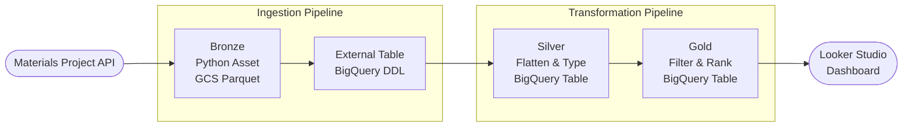
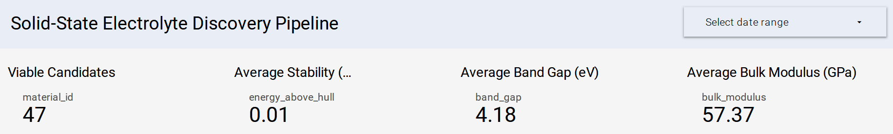
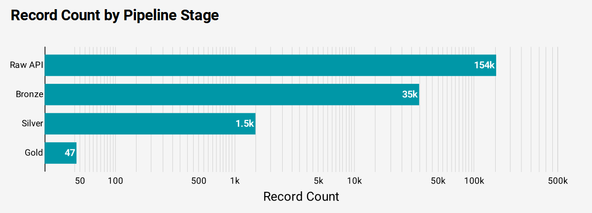
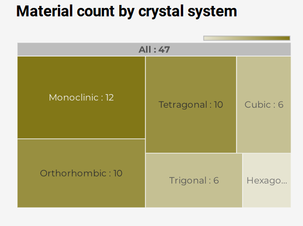
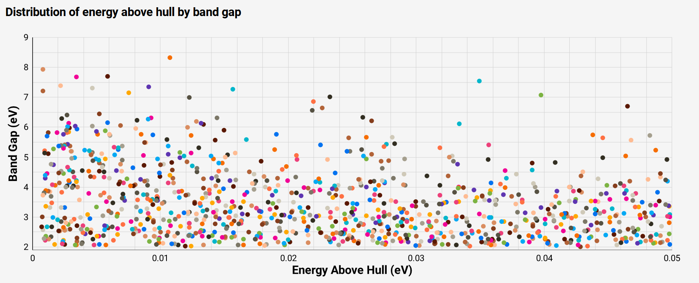
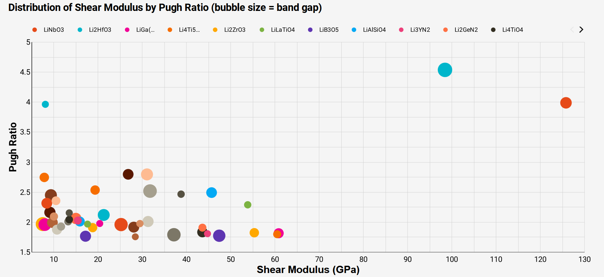
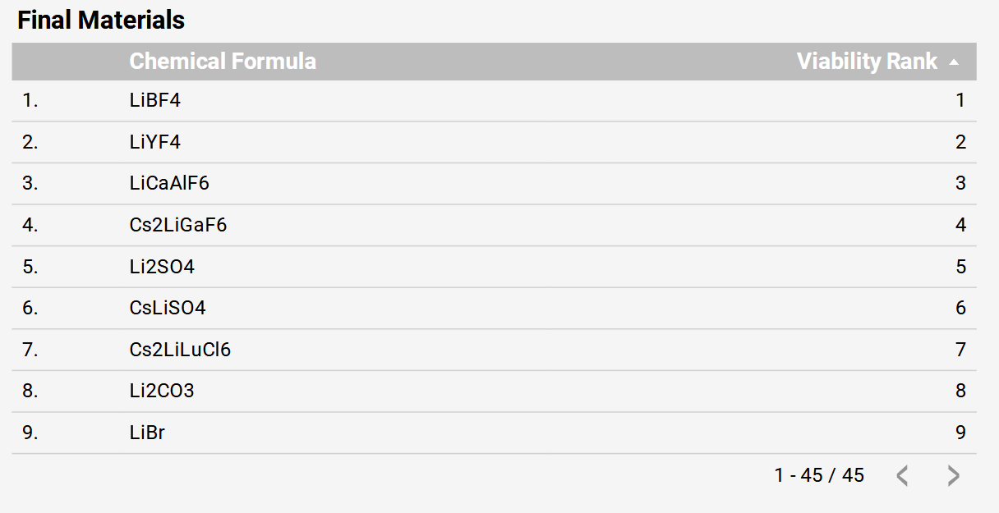

# Lithium Lake — Solid-State Battery Electrolyte Discovery Pipeline

Capstone project for <a href="https://github.com/DataTalksClub/data-engineering-zoomcamp" target="_blank">Data Engineering Zoomcamp 2026</a>.

A data engineering pipeline that queries the <a href="https://github.com/materialsproject" target="_blank">Materials Project</a> database, processes ~2,700 lithium-containing compounds through a Medallion Architecture on GCP, and surfaces the most viable solid-state battery electrolyte candidates ranked by scientific criteria.


---

## Table of Contents

- [Why This Project](#why-this-project)
- [Architecture](#architecture)
- [Scientific Criteria](#scientific-criteria)
- [Stack](#stack)
- [Project Structure](#project-structure)
- [Pipeline Detail](#pipeline-detail)
- [Data Quality](#data-quality)
- [Dashboard](#dashboard)
- [Results](#results)
- [How to Run](#how-to-run)
- [CI/CD](#cicd)
- [Data Source](#data-source)

---

## Why This Project

Today's lithium-ion batteries are approaching their physical limits. State-of-the-art cells reach around 300 Wh/kg, but the automotive industry needs systems exceeding 450 Wh/kg to deliver 600+ km driving ranges. The bottleneck isn't chemistry alone — it's the electrolyte.

Standard liquid electrolytes are organic solvents (ethylene carbonate, dimethyl carbonate) dissolved with lithium salts. They work, but they're flammable, prone to thermal runaway under mechanical stress or overcharging, and their ionic conductivity collapses at sub-zero temperatures — causing lithium to plate as metallic dendrites that can pierce the separator and short the cell.

The solution the industry is converging on is **all-solid-state batteries (ASSBs)**: replacing the liquid with a non-flammable inorganic solid electrolyte. This eliminates the fire risk entirely and, more importantly, enables a **lithium metal anode** — a material with 3,860 mAh/g theoretical capacity (roughly 10× graphite) and the lowest electrochemical reduction potential of any element. The combination of a solid electrolyte with a lithium metal anode and high-voltage cathode is the most viable path to breaking through current energy density ceilings.

The challenge is that finding the right solid electrolyte is genuinely hard. The material must simultaneously satisfy thermodynamic stability, electronic insulation, mechanical rigidity, and ductility requirements that often compete with each other — and it must be manufacturable at scale from earth-abundant, non-toxic elements. Traditional lab-by-lab experimentation can't search this space efficiently.

The <a href="https://github.com/materialsproject" target="_blank">Materials Project</a>, a DOE-funded initiative, hosts DFT-calculated properties for over 150,000 inorganic compounds. This pipeline applies high-throughput computational screening criteria drawn from solid-state battery literature to systematically filter that database — turning 150,000 compounds into a ranked shortlist of 47 high-potential candidates worth experimental attention.

---

## Architecture

The pipeline follows a **Medallion Architecture**: raw data lands in Bronze, gets cleaned and typed in Silver, and the science logic lives in Gold. <a href="https://github.com/bruin-data/bruin" target="_blank">Bruin</a> orchestrates the full pipeline — running Python extraction, executing BigQuery SQL transformations, enforcing asset dependencies, and validating data quality checks at each layer. Infrastructure is provisioned via <a href="https://github.com/hashicorp/terraform" target="_blank">Terraform</a>.



<!-- Architecture diagram image -->
<!--  -->

---

## Scientific Criteria

The Gold layer applies four physical requirements for a viable solid electrolyte:

| Criterion | Threshold | Why |
|---|---|---|
| Thermodynamic stability | `energy_above_hull ≤ 0.05 eV/atom` | Material won't decompose under battery conditions |
| Electronic insulation | `band_gap ≥ 2.0 eV` | Prevents electronic short circuits and dendrite nucleation |
| Dendrite suppression | `shear_modulus ≥ 6.8 GPa` | Mechanically blocks lithium dendrite growth (Monroe-Newman criterion) |
| Ductility (Pugh Ratio) | `bulk_modulus / shear_modulus > 1.75` | Material can be processed and won't crack at interfaces |

### Thermodynamic Stability — `energy_above_hull ≤ 0.05 eV/atom`

In computational materials science, a material's stability is measured by its **energy above the convex hull** — the thermodynamic distance from the ground-state phase at a given composition. A value of 0 means the material is perfectly stable; higher values indicate a driving force toward decomposition.

A naive approach would filter for `is_stable = True` (hull energy exactly 0), but this throws away hundreds of viable candidates. Many of the most promising solid electrolytes — including the argyrodite Li₆PS₅Cl and LGPS (Li₁₀GeP₂S₁₂) — are technically metastable but can be synthesized and stabilized at room temperature through high-temperature processing and rapid quenching. Screening literature establishes that a tolerance of **≤ 50 meV/atom (0.05 eV/atom)** captures these useful metastable phases while rejecting structures that will never be synthesized.

### Electronic Insulation — `band_gap ≥ 2.0 eV`

The electrolyte must block electrons completely — its job is to let lithium ions through while forcing electrons to travel through the external circuit. If electrons can permeate the electrolyte's bulk, the battery self-discharges. Worse, recent research shows that trace electronic conductivity causes Li⁺ ions migrating through the lattice to be prematurely reduced into metallic lithium within internal pores and grain boundaries — nucleating dendrites from the inside.

The threshold of 2.0 eV also accounts for a known artifact in the DFT calculations the Materials Project uses: the standard PBE functional systematically **underestimates** experimental band gaps. A computed 2.0 eV gap often corresponds to a true experimental gap of 3.5 eV or higher. Setting the threshold at 2.0 eV safely eliminates metals and narrow-gap semiconductors without incorrectly rejecting genuine wide-gap insulators.

### Dendrite Suppression — `shear_modulus ≥ 6.8 GPa`

The **Monroe-Newman criterion** is the theoretical framework for dendrite suppression in solid electrolytes. It states that a solid electrolyte can physically block lithium dendrite propagation if its shear modulus is at least twice that of bulk lithium metal. Since lithium metal has a shear modulus of ~3.4 GPa, the threshold is **≥ 6.8 GPa**.

This is where most soft polymer electrolytes (like PEO) fail — their shear moduli are orders of magnitude below this threshold. The Materials Project computes full elastic tensors using Voigt-Reuss-Hill averaging; the pipeline extracts the VRH shear modulus values.

### Ductility — Pugh Ratio `K/G > 1.75`

Stiffness alone isn't enough. Highly rigid oxide ceramics like garnet LLZO exceed the Monroe-Newman shear modulus requirement by 10×, but they are extremely brittle. During battery cycling, electrodes expand and contract — a brittle electrolyte can't accommodate this, leading to delamination, rising interfacial impedance, and physical cracking that lets lithium infiltrate.

**Pugh's ratio** (bulk modulus K divided by shear modulus G) measures ductility. A ratio above 1.75 indicates the material can deform elastically rather than fracture — the "Goldilocks zone" of being stiff enough to block dendrites but flexible enough to maintain contact with the electrodes. Sulfide-based and halide-based electrolytes typically occupy this zone well.

### Toxic and Scarce Element Exclusion

Manufacturing scalability matters as much as physical properties. LGPS (Li₁₀GeP₂S₁₂) exhibits the highest ionic conductivity ever measured in a solid electrolyte (12 mS/cm), yet its commercial viability is crippled by its reliance on Germanium — scaling to 100 GWh/year of production would require increasing global Germanium output by 120×. Similarly, the garnet LLZO requires Tantalum doping whose global supply is less than double current production. Elements like `Pb`, `Tl`, `Hg`, `Cd`, and `As` add environmental toxicity concerns that preclude consumer use. The pipeline excludes all of these at the Gold layer.

---

## Stack

| Layer | Tool | Why |
|---|---|---|
| Orchestration & Transformation | Bruin | Runs Python and BigQuery SQL assets, enforces cross-pipeline dependencies, executes column-level data quality checks after each materialization |
| Infrastructure | Terraform | Reproducible GCS + BigQuery provisioning, version-controlled infra |
| Raw storage | Google Cloud Storage | Cheap Parquet storage, natively queryable by BigQuery external tables |
| Warehouse | BigQuery | Serverless, scales to any size, external table support avoids double storage |
| Containerization | Docker | One-command reproducibility for reviewers with zero local setup |
| CI/CD | GitHub Actions | Validates pipeline assets on every push, free for public repos |
| Dashboard | Looker Studio | Native BigQuery connector, shareable public URL, no code required |
| Data source | [Materials Project API](https://next-gen.materialsproject.org/api) | Open DFT database with 150k+ inorganic materials and elasticity data |

---

## Project Structure

```
lithium-lake/
├── pipelines/
│   ├── ingestion/
│   │   ├── pipeline.yml
│   │   └── assets/
│   │       ├── materials_bronze.py       # API → GCS
│   │       └── materials_external.sql    # GCS → BigQuery external table
│   └── transformation/
│       ├── pipeline.yml
│       └── assets/
│           ├── materials_silver.sql      # flatten, cast, clean
│           └── materials_gold.sql        # filter, rank, output
├── .github/
│   └── workflows/
│       └── validate.yml                  # Bruin validation on push
├── Dockerfile
├── docker-compose.yml
├── main.tf                               # GCS bucket + BigQuery dataset
├── variables.tf
├── requirements.txt
└── .env.example
```

---

## Pipeline Detail

### Bronze — `ingestion.materials_bronze`

Queries the Materials Project API for all lithium-containing compounds with 2–4 elements, thermodynamic stability within 50 meV/atom of the convex hull, and a band gap above 2 eV. Results are serialized to Parquet and uploaded to GCS.

Checks run after upload:
- Row count > 0
- `material_id` is never null
- Every row contains Li in its elements list

### External Table — `lithium_lake_data.materials_external`

A `CREATE OR REPLACE EXTERNAL TABLE` DDL that points BigQuery at the GCS Parquet. No data is copied — BigQuery reads the file directly. Runs after Bronze to always pick up the latest schema.

### Silver — `lithium_lake_data.materials_silver`

Flattens the nested Parquet structures into typed BigQuery columns:
- `shear_modulus.vrh` and `bulk_modulus.vrh` → `FLOAT64` scalars
- `symmetry.crystal_system`, `.symbol`, `.number` → flat STRING/INT columns
- `elements.list[].element` → `ARRAY<STRING>`
- `last_updated` → `TIMESTAMP`
- Adds `has_elasticity_data` boolean flag (shear and bulk modulus are sparse in the database)

Clustered by `crystal_system`. Quality checks validate that the Bronze API filters held.

### Gold — `lithium_lake_data.materials_gold`

Applies the four scientific thresholds. Computes `pugh_ratio = bulk_modulus / shear_modulus`. Ranks all passing candidates by `energy_above_hull ASC, band_gap DESC` — lower hull energy and higher band gap both indicate a better electrolyte.

Result: **47 candidates** from 2,720 input materials.

---

## Data Quality

Quality checks run automatically after each asset materializes.

**Bronze (Python assertions):**
- `len(df) > 0`
- `material_id` not null
- `Li` in every `elements` list

**Silver (Bruin column checks):**
- `material_id`: not null, unique
- `band_gap`: not null, min 2.0
- `energy_above_hull`: not null, min 0, max 0.05

**Gold (Bruin column checks):**
- `material_id`: not null, unique
- `shear_modulus`: min 6.8
- `pugh_ratio`: min 1.75

---

## Dashboard

The full dashboard is available here: [Looker Studio — Solid-State Electrolyte Discovery Pipeline](https://datastudio.google.com/reporting/388a287d-e742-4ac8-9773-c3df8195b233)

The dashboard connects directly to the Gold and Silver BigQuery tables and shows the full picture from raw API to final candidates.

**Summary scorecards** — top-level numbers from the Gold layer: 47 viable candidates, average hull energy of 0.01 eV/atom, average band gap of 4.18 eV, and average bulk modulus of 57.37 GPa.



*Key metrics from the Gold layer — 47 candidates, average hull energy 0.01 eV/atom, band gap 4.18 eV, bulk modulus 57.37 GPa.*

**Record count by pipeline stage** — shows how aggressively each layer filters the data. The Materials Project database holds 154,000 compounds. The Bronze query pulls 35,000 lithium-containing materials. Silver retains ~1,500 after flattening and typing. Gold cuts that to 47 after applying all four scientific thresholds.



*154k Materials Project compounds → 35k lithium-containing → 1.5k after Silver cleaning → 47 Gold candidates.*

**Crystal system distribution** — of the 47 final candidates, monoclinic dominates with 12 materials, followed by tetragonal and orthorhombic at 10 each. Cubic and trigonal contribute 6 each. These are all crystal systems known for relatively isotropic mechanical behavior, which is consistent with passing the Pugh Ratio filter.



*Monoclinic leads with 12 candidates, followed by tetragonal and orthorhombic at 10 each.*

**Energy above hull vs. band gap scatter** — plots all Silver-layer materials by their two most critical properties. The x-axis spans 0 to 0.05 eV/atom (our stability window) and the y-axis shows band gap in eV. Each color represents a different crystal system. The Gold candidates cluster toward the left edge (low hull energy) and upper region (high band gap).



*All Silver-layer materials plotted by thermodynamic stability and band gap, colored by crystal system. Gold candidates cluster toward low hull energy and high band gap.*

**Shear modulus vs. Pugh Ratio bubble chart** — restricted to Gold candidates, with bubble size proportional to band gap. Li₂HfO₃ stands out with a shear modulus near 97 GPa and a Pugh Ratio above 4.5, making it one of the mechanically strongest candidates. LiNbO₃ reaches the highest shear modulus at ~125 GPa.



*Gold candidates only. Bubble size = band gap. Li₂HfO₃ stands out with the highest Pugh Ratio (~4.5) at near-100 GPa shear modulus.*

---

## Results

Starting from 2,720 lithium-containing compounds, the pipeline narrows to **47 viable solid-state electrolyte candidates** after applying all four scientific criteria and excluding toxic elements.

Candidates are ranked by two sequential criteria: first by `energy_above_hull` ascending (thermodynamic stability — closer to 0 is better), then by `band_gap` descending (wider gap means better electronic insulation). This ordering reflects a deliberate priority: a material that decomposes under battery conditions is disqualifying regardless of its other properties, while among equally stable candidates, the one that better prevents short-circuiting ranks higher.



*All 47 candidates ranked by viability — primary sort by energy above hull (stability), secondary by band gap (insulation).*

Key observations:
- LiBF₄, LiYF₄, and LiCaAlF₆ occupy the top three spots — all fluoride-based compounds, consistent with the well-known stability of the fluorine chemistry at lithium metal interfaces
- Several candidates sit at `energy_above_hull = 0`, meaning they are exactly on the convex hull and thermodynamically optimal
- The Pugh Ratio filter is the most selective after the elasticity data requirement, cutting ~60% of remaining candidates
- Monoclinic structures dominate the final set, which reflects the fact that many stable lithium compounds naturally adopt lower-symmetry arrangements at room temperature

---

## How to Run

### Prerequisites

- Docker and Docker Compose
- A [Materials Project API key](https://next-gen.materialsproject.org/api)
- A GCP service account JSON with `BigQuery Admin` and `Storage Admin` roles

### Setup

1. Clone the repo:
   ```bash
   git clone https://github.com/middaycoffeemiddaycoffee/lithium-lake.git
   cd lithium-lake
   ```

2. Create a `.env` file from the example:
   ```bash
   cp .env.example .env
   ```
   Fill in your Materials Project API key.

3. Place your GCP service account key at the project root:
   ```
   gcp-service.json
   ```

4. Provision GCP infrastructure with Terraform:
   ```bash
   terraform init
   terraform apply
   ```

5. Run the full pipeline:
   ```bash
   docker compose up
   ```

This runs Bronze → External → Silver → Gold in the correct dependency order. The final Gold table will be available in BigQuery at `lithium-lake.lithium_lake_data.materials_gold`.

---

## CI/CD

On every push to `main`, GitHub Actions runs `bruin validate` against both pipelines to catch broken asset definitions before they reach production.

---

## Data Source

All materials data comes from <a href="https://github.com/materialsproject" target="_blank">The Materials Project</a>, a DOE-funded initiative that provides open computational data on inorganic materials. The pipeline uses the `mp-api` Python client to query the `materials/summary` endpoint.

The database is updated periodically as new DFT calculations are completed — the `last_updated` field tracks when each material's data was last revised.
